Banner Image Credit [ChatGPT](https://chat.openai.com)

# Seaborn Examples

Seaborn python package build on top of `matplotlib` for plotting statistical data. It has great support for the commonly used pandas data structure in handling tabular data. It's more opinionated than `matplotlib` which makes it easier to get started with and provides higher level API for plotting which will help us create plots with fewer number of lines and configuration that we need in `matplotlib` for the same graphics.\
\
Visualizing data using tools like `seaborn` help us explore and understand the data. In this post we'll explore some of the available graphics demonstrate how we can use to plot different data types we might have.\
\
To help with the clarity of this post, I've organized it into six sections. Following this introductory section, we'll see the prerequisite setup and imports. In the setup section I'll discuss the sample datasets that come with `seaborn`. The third and fourth sections are about `seaborn` plots for Categorical and Continues Data, respectively. Then I'll discuss how we can plot comparative plots followed by a section on utilities such as styling and saving plots.

## Setup
### Installation
First step is t install the `seaborn` package. For that, we can use `pip` as


```python
%pip install seaborn
```

    Requirement already satisfied: seaborn in /Users/yoseph/anaconda3/envs/CS5805/lib/python3.11/site-packages (0.13.0)
    Requirement already satisfied: numpy!=1.24.0,>=1.20 in /Users/yoseph/anaconda3/envs/CS5805/lib/python3.11/site-packages (from seaborn) (1.23.5)
    Requirement already satisfied: pandas>=1.2 in /Users/yoseph/anaconda3/envs/CS5805/lib/python3.11/site-packages (from seaborn) (2.0.3)
    Requirement already satisfied: matplotlib!=3.6.1,>=3.3 in /Users/yoseph/anaconda3/envs/CS5805/lib/python3.11/site-packages (from seaborn) (3.7.1)
    Requirement already satisfied: contourpy>=1.0.1 in /Users/yoseph/anaconda3/envs/CS5805/lib/python3.11/site-packages (from matplotlib!=3.6.1,>=3.3->seaborn) (1.0.5)
    Requirement already satisfied: cycler>=0.10 in /Users/yoseph/anaconda3/envs/CS5805/lib/python3.11/site-packages (from matplotlib!=3.6.1,>=3.3->seaborn) (0.11.0)
    Requirement already satisfied: fonttools>=4.22.0 in /Users/yoseph/anaconda3/envs/CS5805/lib/python3.11/site-packages (from matplotlib!=3.6.1,>=3.3->seaborn) (4.25.0)
    Requirement already satisfied: kiwisolver>=1.0.1 in /Users/yoseph/anaconda3/envs/CS5805/lib/python3.11/site-packages (from matplotlib!=3.6.1,>=3.3->seaborn) (1.4.4)
    Requirement already satisfied: packaging>=20.0 in /Users/yoseph/anaconda3/envs/CS5805/lib/python3.11/site-packages (from matplotlib!=3.6.1,>=3.3->seaborn) (23.0)
    Requirement already satisfied: pillow>=6.2.0 in /Users/yoseph/anaconda3/envs/CS5805/lib/python3.11/site-packages (from matplotlib!=3.6.1,>=3.3->seaborn) (9.4.0)
    Requirement already satisfied: pyparsing>=2.3.1 in /Users/yoseph/anaconda3/envs/CS5805/lib/python3.11/site-packages (from matplotlib!=3.6.1,>=3.3->seaborn) (3.0.9)
    Requirement already satisfied: python-dateutil>=2.7 in /Users/yoseph/anaconda3/envs/CS5805/lib/python3.11/site-packages (from matplotlib!=3.6.1,>=3.3->seaborn) (2.8.2)
    Requirement already satisfied: pytz>=2020.1 in /Users/yoseph/anaconda3/envs/CS5805/lib/python3.11/site-packages (from pandas>=1.2->seaborn) (2022.7)
    Requirement already satisfied: tzdata>=2022.1 in /Users/yoseph/anaconda3/envs/CS5805/lib/python3.11/site-packages (from pandas>=1.2->seaborn) (2023.3)
    Requirement already satisfied: six>=1.5 in /Users/yoseph/anaconda3/envs/CS5805/lib/python3.11/site-packages (from python-dateutil>=2.7->matplotlib!=3.6.1,>=3.3->seaborn) (1.16.0)
    Note: you may need to restart the kernel to use updated packages.


### Imports
To get started with `seaborn` we need to import the following packages. We import `pyplot` form `matplotlib` to use the lower level APIs later for styling and customization. While working with Jupyter notebooks we might want to suppers warnings in the output.


```python
import numpy as np
import seaborn as sns
import matplotlib.pyplot as plt
import warnings
```

### Jupyter Configurations 

Ask Jupyter to display plots within the notebook


```python
%matplotlib inline
%reload_ext autoreload
%autoreload 2
```

Suppress warnings 


```python
import warnings
warnings.filterwarnings('ignore')
```

### Data

Plotting only makes sense if we have some data to visualize. We can plot any data stored in pandas data structure using `seaborn`. This let's us load and process data using pandas and use `seaborn` for visualization in parallel. For this post, I'll make use of sample datasets shipped with `seaborn`. To get the full list of datasets available in our installation we can as `seaborn` itself


```python
print(sns.get_dataset_names())
```

    ['anagrams', 'anscombe', 'attention', 'brain_networks', 'car_crashes', 'diamonds', 'dots', 'dowjones', 'exercise', 'flights', 'fmri', 'geyser', 'glue', 'healthexp', 'iris', 'mpg', 'penguins', 'planets', 'seaice', 'taxis', 'tips', 'titanic']


Let's load two datasets and examine their content. More information on the datasets can be found [here](https://medium.com/r/?url=https%3A%2F%2Fwww.kaggle.com%2Fdatasets%2Ffivethirtyeight%2Ffivethirtyeight-bad-drivers-dataset) and [here](https://medium.com/r/?url=https%3A%2F%2Fwww.kaggle.com%2Fc%2Ftitanic%2Fdata)


```python
crashes = sns.load_dataset('car_crashes')
titanic = sns.load_dataset('titanic')
```

Examine the content of the data


```python
crashes.head()
```


<div>
<style scoped>
    .dataframe tbody tr th:only-of-type {
        vertical-align: middle;
    }

    .dataframe tbody tr th {
        vertical-align: top;
    }

    .dataframe thead th {
        text-align: right;
    }
</style>
<table border="1" class="dataframe">
  <thead>
    <tr style="text-align: right;">
      <th></th>
      <th>total</th>
      <th>speeding</th>
      <th>alcohol</th>
      <th>not_distracted</th>
      <th>no_previous</th>
      <th>ins_premium</th>
      <th>ins_losses</th>
      <th>abbrev</th>
    </tr>
  </thead>
  <tbody>
    <tr>
      <th>0</th>
      <td>18.8</td>
      <td>7.332</td>
      <td>5.640</td>
      <td>18.048</td>
      <td>15.040</td>
      <td>784.55</td>
      <td>145.08</td>
      <td>AL</td>
    </tr>
    <tr>
      <th>1</th>
      <td>18.1</td>
      <td>7.421</td>
      <td>4.525</td>
      <td>16.290</td>
      <td>17.014</td>
      <td>1053.48</td>
      <td>133.93</td>
      <td>AK</td>
    </tr>
    <tr>
      <th>2</th>
      <td>18.6</td>
      <td>6.510</td>
      <td>5.208</td>
      <td>15.624</td>
      <td>17.856</td>
      <td>899.47</td>
      <td>110.35</td>
      <td>AZ</td>
    </tr>
    <tr>
      <th>3</th>
      <td>22.4</td>
      <td>4.032</td>
      <td>5.824</td>
      <td>21.056</td>
      <td>21.280</td>
      <td>827.34</td>
      <td>142.39</td>
      <td>AR</td>
    </tr>
    <tr>
      <th>4</th>
      <td>12.0</td>
      <td>4.200</td>
      <td>3.360</td>
      <td>10.920</td>
      <td>10.680</td>
      <td>878.41</td>
      <td>165.63</td>
      <td>CA</td>
    </tr>
  </tbody>
</table>
</div>


```python
titanic.head()
```


<div>
<style scoped>
    .dataframe tbody tr th:only-of-type {
        vertical-align: middle;
    }

    .dataframe tbody tr th {
        vertical-align: top;
    }

    .dataframe thead th {
        text-align: right;
    }
</style>
<table border="1" class="dataframe">
  <thead>
    <tr style="text-align: right;">
      <th></th>
      <th>survived</th>
      <th>pclass</th>
      <th>sex</th>
      <th>age</th>
      <th>sibsp</th>
      <th>parch</th>
      <th>fare</th>
      <th>embarked</th>
      <th>class</th>
      <th>who</th>
      <th>adult_male</th>
      <th>deck</th>
      <th>embark_town</th>
      <th>alive</th>
      <th>alone</th>
    </tr>
  </thead>
  <tbody>
    <tr>
      <th>0</th>
      <td>0</td>
      <td>3</td>
      <td>male</td>
      <td>22.0</td>
      <td>1</td>
      <td>0</td>
      <td>7.2500</td>
      <td>S</td>
      <td>Third</td>
      <td>man</td>
      <td>True</td>
      <td>NaN</td>
      <td>Southampton</td>
      <td>no</td>
      <td>False</td>
    </tr>
    <tr>
      <th>1</th>
      <td>1</td>
      <td>1</td>
      <td>female</td>
      <td>38.0</td>
      <td>1</td>
      <td>0</td>
      <td>71.2833</td>
      <td>C</td>
      <td>First</td>
      <td>woman</td>
      <td>False</td>
      <td>C</td>
      <td>Cherbourg</td>
      <td>yes</td>
      <td>False</td>
    </tr>
    <tr>
      <th>2</th>
      <td>1</td>
      <td>3</td>
      <td>female</td>
      <td>26.0</td>
      <td>0</td>
      <td>0</td>
      <td>7.9250</td>
      <td>S</td>
      <td>Third</td>
      <td>woman</td>
      <td>False</td>
      <td>NaN</td>
      <td>Southampton</td>
      <td>yes</td>
      <td>True</td>
    </tr>
    <tr>
      <th>3</th>
      <td>1</td>
      <td>1</td>
      <td>female</td>
      <td>35.0</td>
      <td>1</td>
      <td>0</td>
      <td>53.1000</td>
      <td>S</td>
      <td>First</td>
      <td>woman</td>
      <td>False</td>
      <td>C</td>
      <td>Southampton</td>
      <td>yes</td>
      <td>False</td>
    </tr>
    <tr>
      <th>4</th>
      <td>0</td>
      <td>3</td>
      <td>male</td>
      <td>35.0</td>
      <td>0</td>
      <td>0</td>
      <td>8.0500</td>
      <td>S</td>
      <td>Third</td>
      <td>man</td>
      <td>True</td>
      <td>NaN</td>
      <td>Southampton</td>
      <td>no</td>
      <td>True</td>
    </tr>
  </tbody>
</table>
</div>


## Categorical Data
Categorical data is form of qualitative data that can be stored and identified based on distinct labels. Instead of being measured numerically, it is a type of information that can be grouped into categories. For example, the sex column in our titanic dataset has two labels: male and female. Similarly the abbrev column is a list of state name abbreviations in the US which has a total of 50 labels. 
In this section, we will see bar and count plots from `seaborn` as two graphics to visualize categorical data.\
\
In this section, we will see bar and count plots from `seaborn` as two graphics to visualize categorical data.

### Bar Plots
Also referred to as `bar chart`, bar plot is, a bar plot allows us to visualize the comparisons between the discrete labels or categories in our data. Bar chart is a graph that represents the category of data with horizontally or vertically rectangular bars with lengths and heights that is proportional to the values which they represent. One of the axis of the plot represents the specific categories being compared, while the other axis represents the measured values corresponding to those categories.


```python
sns.barplot(data = titanic, x = 'sex', y='fare')
```


    <Axes: xlabel='sex', ylabel='fare'>


    
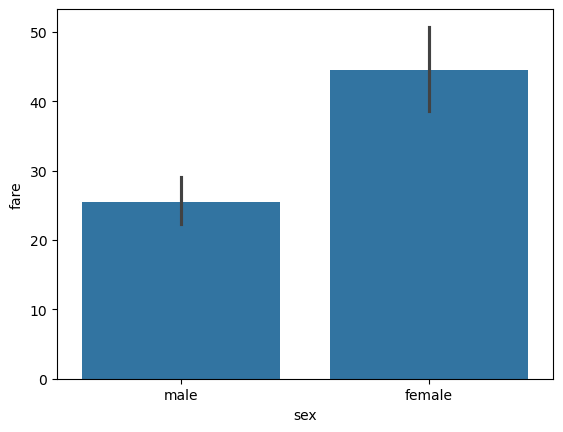
    


By Default the data is aggregated by mean of `y`


```python
sns.barplot(data = titanic, x = 'sex', y='fare', estimator=np.median)
```


    <Axes: xlabel='sex', ylabel='fare'>


    
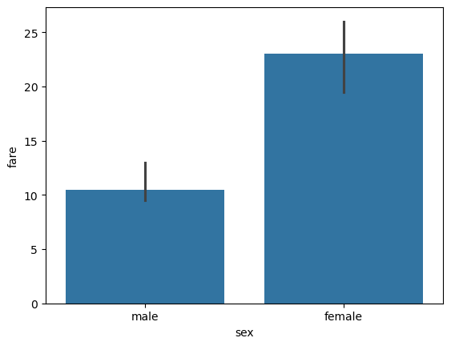
    


### Count Plots
Similar to bar plot but uses count as the estimator


```python
sns.countplot(data = titanic, x = 'sex')
```


    <Axes: xlabel='sex', ylabel='count'>


    
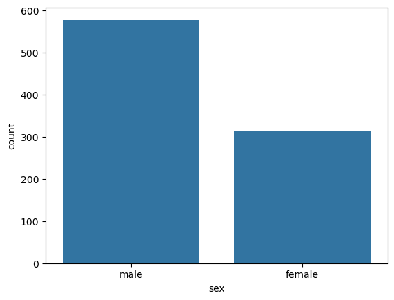
    


We can display a count of the number rows in each category of values in the alive column


```python
sns.countplot(data = titanic, x = 'alive')
```


    <Axes: xlabel='alive', ylabel='count'>


    
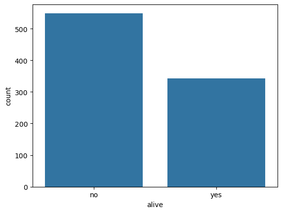
    


## Distribution Plots

Distribution plots for continuous data variables.In the past, `Seaborn` had a `distplot` method which supported displaying a histogram plot by with kde on top default. `distplot` is deprecated and it is recommended we use `displot` or `histplot` for find grained control. `distplot` allow as to display a histogram of univariate or bivariate distribution of the data in a dataset.


```python
sns.distplot(a=crashes['alcohol'])
 
```


    <Axes: xlabel='alcohol', ylabel='Density'>


    
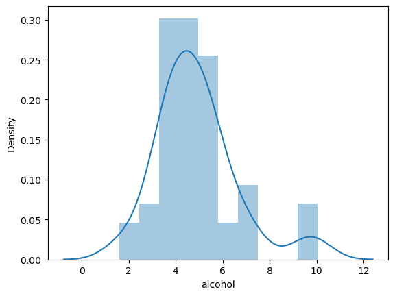
    


If we don't what the kde plot to be visible we can tell seaborn not to show it


```python
sns.distplot(a=crashes['alcohol'],kde=False)

```


    <Axes: xlabel='alcohol'>


    
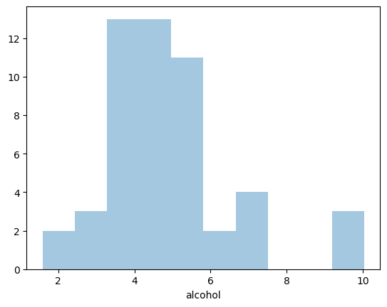
    


```python
sns.displot(data=crashes['alcohol'])
```


    <seaborn.axisgrid.FacetGrid at 0x1513a3010>


    

    


The equivalent plot can be displayed using the new `displot` method


```python
# We can specify name of the data column in the dataset if there are more than one
sns.displot(data=crashes, x='alcohol')
```


    <seaborn.axisgrid.FacetGrid at 0x15144ef50>


    
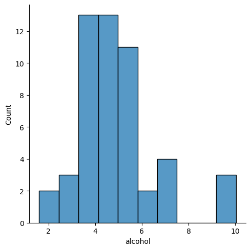
    


`displot`  combines a histogram with optional components, such as a Kernel Density Estimation (KDE) line or rug plot. We can specify which type we want to plot using the kind key (default is hist)


```python
sns.displot(data=crashes['alcohol'], kind='kde')
```


    <seaborn.axisgrid.FacetGrid at 0x15165e890>


    
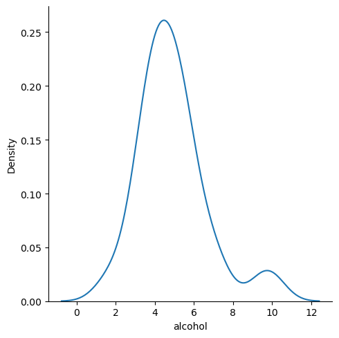
    


We can enable an overlay of other visualization on top of the default. We can do this by passing a boolean value for the parameters `hist`, `ecdf`, `kde`, `rug`


```python
sns.displot(data=crashes['alcohol'], kde=True, rug=True)
```


    <seaborn.axisgrid.FacetGrid at 0x1515b2690>


    
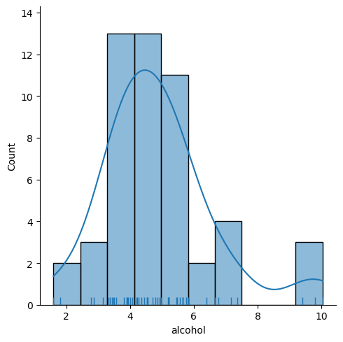
    


```python
sns.displot(data=titanic, x='age', hue='sex', kind='kde', multiple='stack')
```


    <seaborn.axisgrid.FacetGrid at 0x151748250>


    
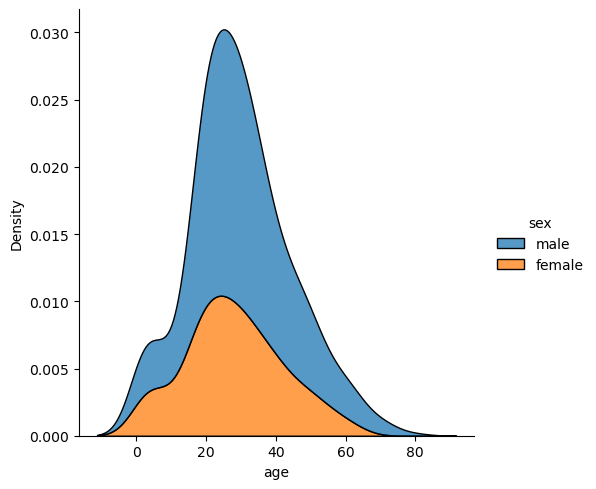
    


### KDE Plot
We can display kde plots using the `kdeplot` function as well


```python
sns.kdeplot(data=titanic, x='fare')
```


    <Axes: xlabel='fare', ylabel='Density'>


    
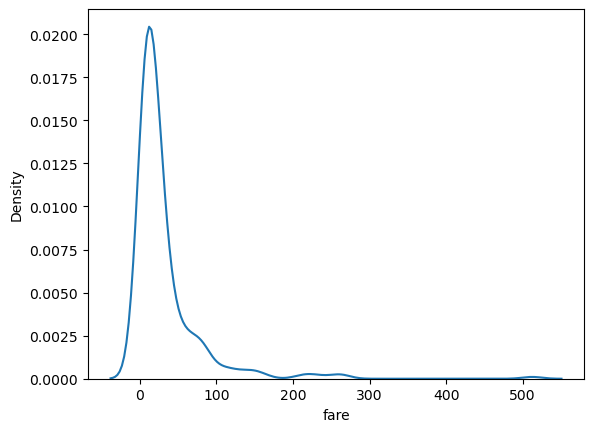
    


## Categorical Plots

### Box Plot
Compare different variables


```python
sns.boxplot(data = titanic, x = 'alive', y='fare', hue='sex')
```


    <Axes: xlabel='alive', ylabel='fare'>


    
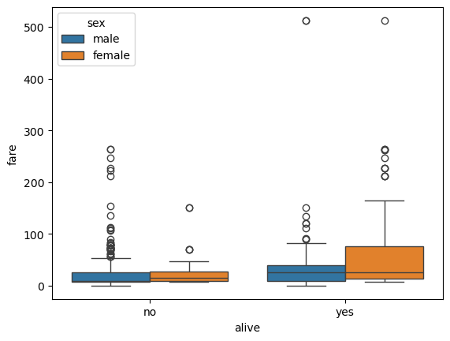
    


### Violin Plot
Compare different variables in a different visualization 


```python
sns.violinplot(data = titanic, x = 'alive', y='fare', hue='sex')
```


    <Axes: xlabel='alive', ylabel='fare'>


    
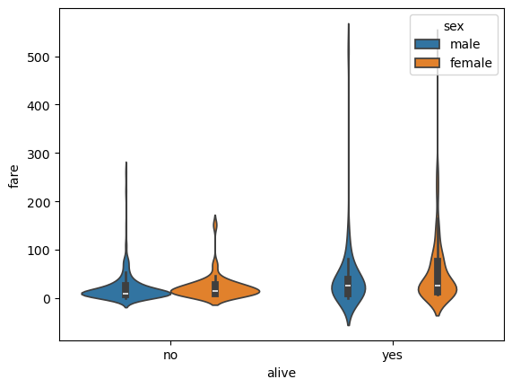
    


```python
sns.violinplot(data = titanic, x = 'alive', y='fare', hue='sex', split=True)
```


    <Axes: xlabel='alive', ylabel='fare'>


    
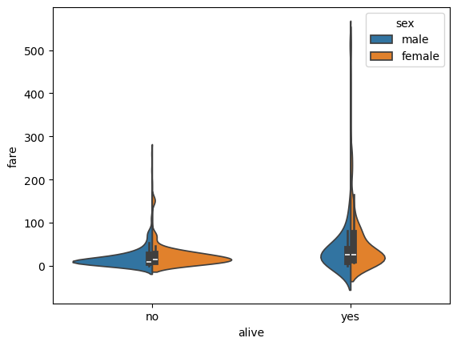
    


```python
#survived	pclass	sex	age	sibsp	parch	fare	embarked	class	who	adult_male	deck	embark_town	alive	alone
sns.violinplot(data = titanic, x = 'alive', y='fare')
```


    <Axes: xlabel='alive', ylabel='fare'>


    
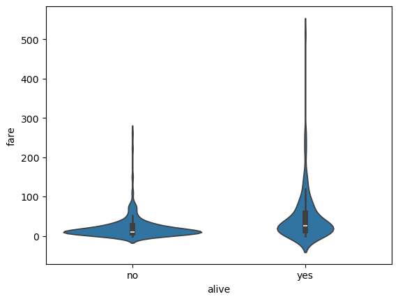
    


### Strip Plot


```python
sns.stripplot(data = titanic, x = 'class', y='fare')
```


    <Axes: xlabel='class', ylabel='fare'>


    
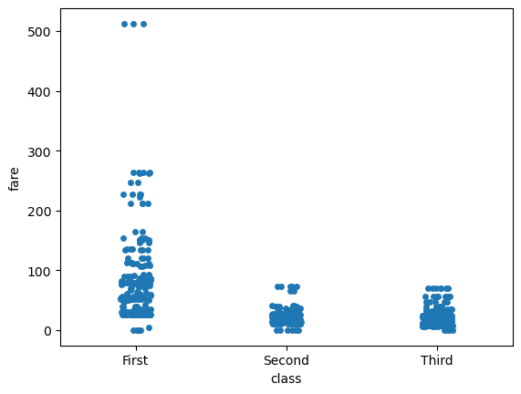
    


```python
sns.stripplot(data = titanic, x = 'class', y='fare', hue='sex')
```


    <Axes: xlabel='class', ylabel='fare'>


    
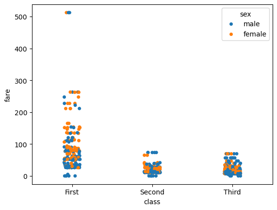
    


### Swarm Plot


```python
sns.swarmplot(data = titanic, x = 'alive', y='fare')
```


    <Axes: xlabel='alive', ylabel='fare'>


    
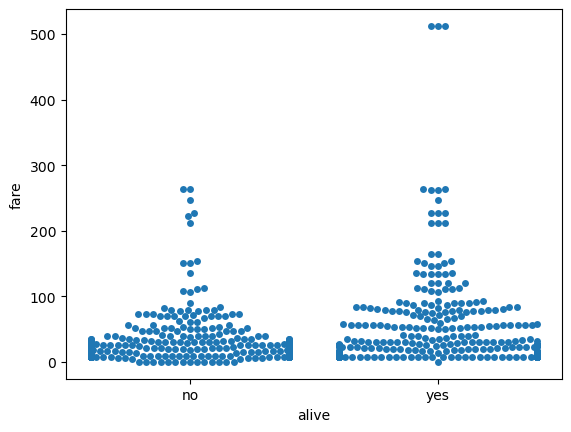
    


## Comparing Data


```python
sns.displot(data=titanic, x='age', col='survived',  kind='kde')
```


    <seaborn.axisgrid.FacetGrid at 0x151881a50>


    
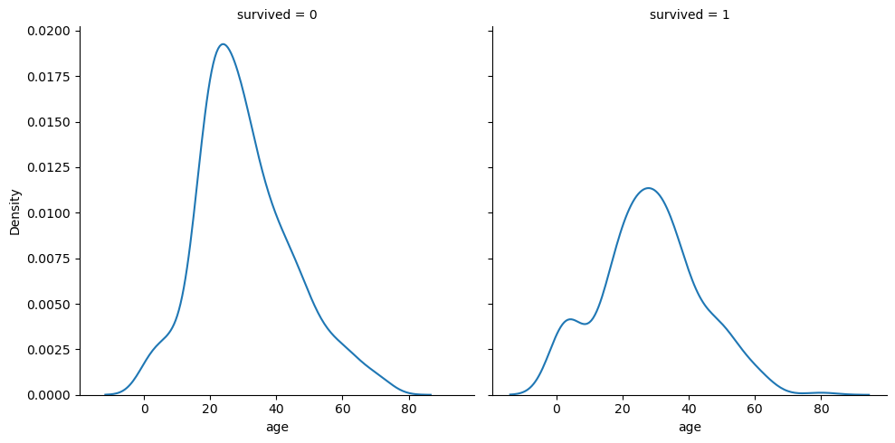
    


```python
sns.displot(data=titanic, x='age', col='survived', hue='sex', kind='kde', multiple='stack')
```


    <seaborn.axisgrid.FacetGrid at 0x1519cbf10>


    
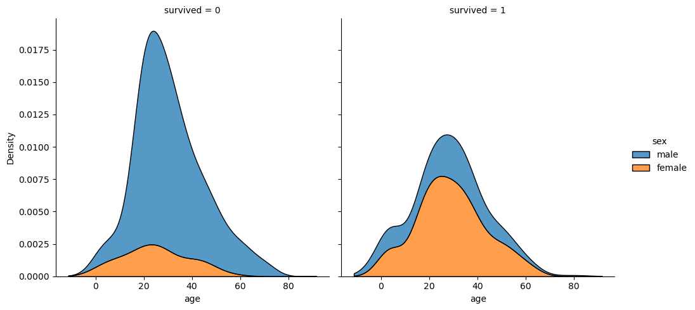
    


### Joint Plot

Used for comparing two distributions. By default it uses scatter plot


```python
sns.jointplot(data=crashes, x='speeding',y='alcohol')
```


    <seaborn.axisgrid.JointGrid at 0x151b780d0>


    
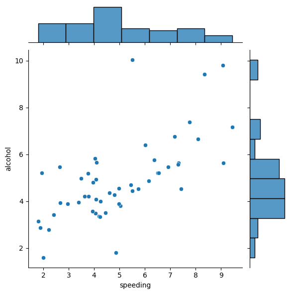
    


```python
sns.jointplot(data=crashes, x='speeding',y='alcohol', kind='kde')
```


    <seaborn.axisgrid.JointGrid at 0x151c91350>


    
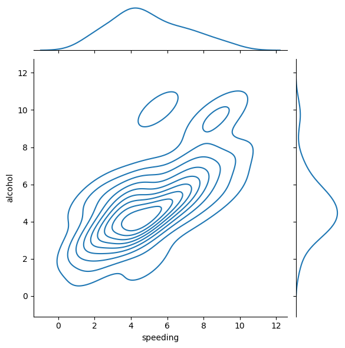
    


```python
sns.jointplot(data=crashes, x='speeding',y='alcohol', kind='reg')
```


    <seaborn.axisgrid.JointGrid at 0x151e06dd0>


    
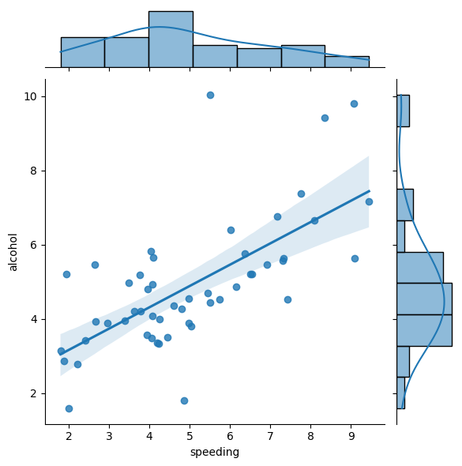
    


```python
sns.jointplot(data=titanic, x='fare',y='age')
```


    <seaborn.axisgrid.JointGrid at 0x15207a6d0>


    
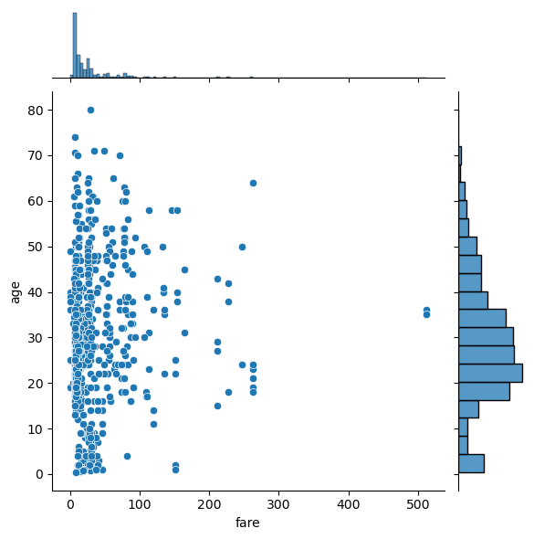
    


### Pair Plot

We can display pair plots across the entire dataset for each pair of numeric attributes


```python
sns.pairplot(data=crashes)
```


    <seaborn.axisgrid.PairGrid at 0x152171d90>


    
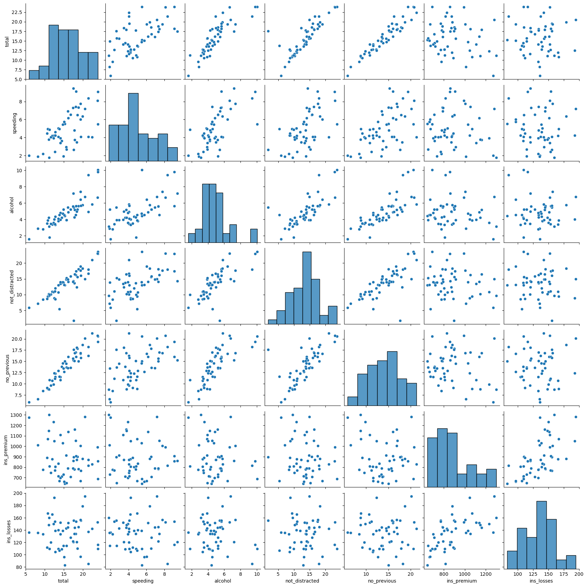
    


We can use hue to have color palettes of categorical data


```python
sns.pairplot(data=titanic, hue='sex')
```


    <seaborn.axisgrid.PairGrid at 0x1534f2390>


    
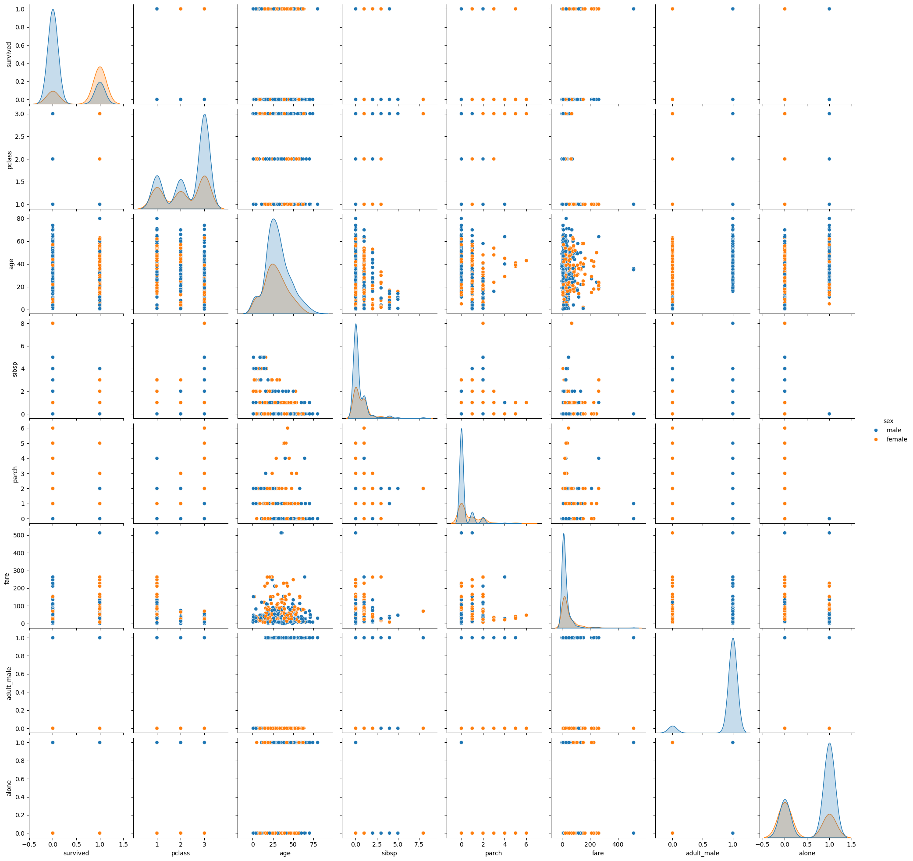
    


```python

```


    <Axes: xlabel='alive', ylabel='fare'>


    

    


```python

```


    <Axes: xlabel='class', ylabel='fare'>


    
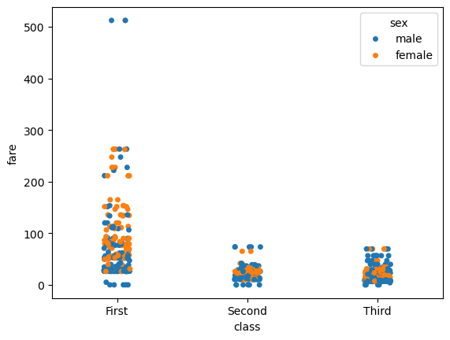
    


```python
sns.stripplot(data = titanic, x = 'class', y='fare', hue='sex',jitter=True)
```


    <Axes: xlabel='class', ylabel='fare'>


    
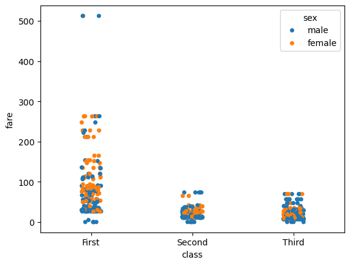
    


```python
sns.stripplot(data = titanic, x = 'class', y='fare', hue='sex',jitter=True, dodge=True)
```


    <Axes: xlabel='class', ylabel='fare'>


    
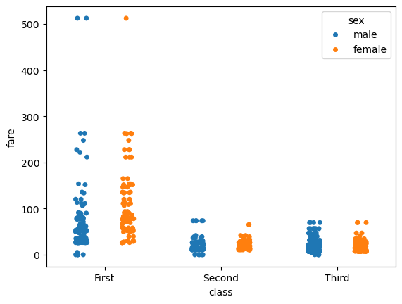
    


```python

```


    <Axes: xlabel='alive', ylabel='fare'>


    

    


```python
sns.swarmplot(data = titanic, x = 'alive', y='fare', color='red')
```


    <Axes: xlabel='alive', ylabel='fare'>


    
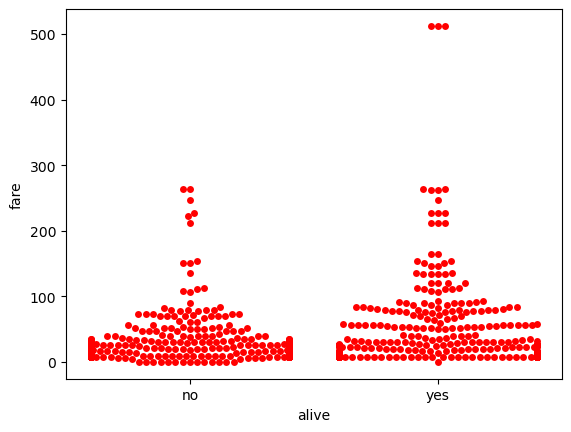
    


## Other Feature

### Resizing

We can resize the plot using `height`, `width` and `aspect` parameters 


```python
sns.displot(data = crashes, x = 'total', height = 2 , aspect = 1.6)
```


    <seaborn.axisgrid.FacetGrid at 0x157d10cd0>


    
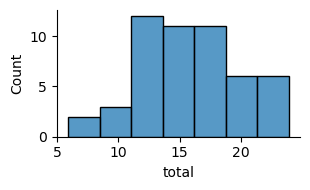
    


### Styling


```python
sns.set_style('darkgrid')
sns.jointplot(data=crashes, x='speeding',y='alcohol', kind='reg', height = 4 )
```


    <seaborn.axisgrid.JointGrid at 0x1581e9d90>


    
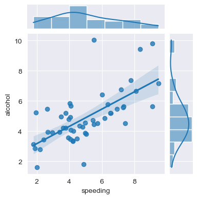
    


```python
sns.set_style('whitegrid')
sns.jointplot(data=crashes, x='speeding',y='alcohol', kind='reg', height = 4 )
```


    <seaborn.axisgrid.JointGrid at 0x1583f3610>


    
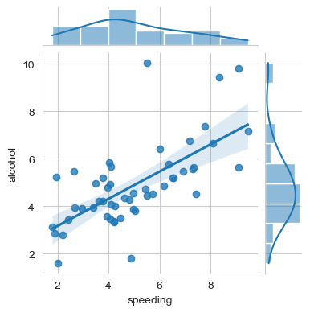
    


```python
sns.set_style('ticks')
sns.jointplot(data=crashes, x='speeding',y='alcohol', kind='reg', height = 4 )
```


    <seaborn.axisgrid.JointGrid at 0x15855a5d0>


    
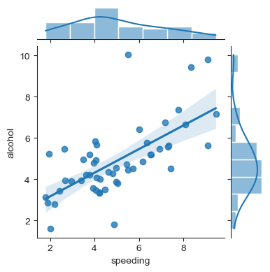
    


### Label Styling


```python
sns.set_context('poster')
sns.jointplot(data=crashes, x='speeding',y='alcohol', kind='reg', height = 4 )
```


    <seaborn.axisgrid.JointGrid at 0x149f35950>


    
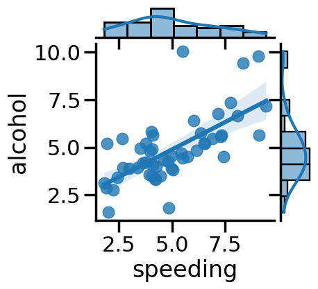
    


```python
sns.set_context('paper')
sns.jointplot(data=crashes, x='speeding',y='alcohol', kind='reg', height = 4 )
```


    <seaborn.axisgrid.JointGrid at 0x15879d2d0>


    
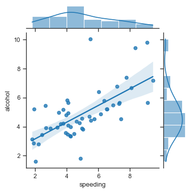
    


```python
sns.jointplot(data=crashes, x='speeding',y='alcohol', kind='reg', height = 4 )
sns.despine(left=True, bottom=True) # False turns off the boundary 

```


    
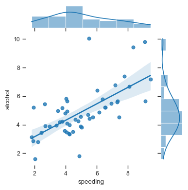
    


### Save Plot

Since seaboarn is built on top of the `matplotlib` package, we can use `matplotlib`'s  `savefig()` function to save the generated plot into image file.\
__Note__: The `savefig()` function should come before the `show()` function since the later closes and deletes the image from the memory to save space.


```python
sns.displot(crashes['alcohol'])
plt.savefig('picture.png')
plt.show()
```


    
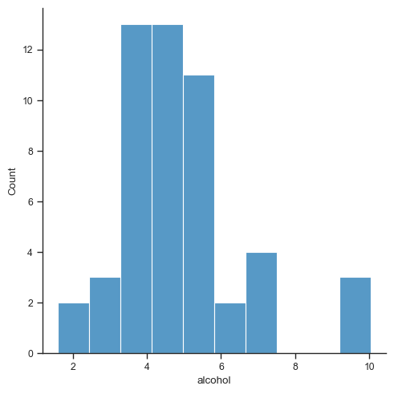
    

